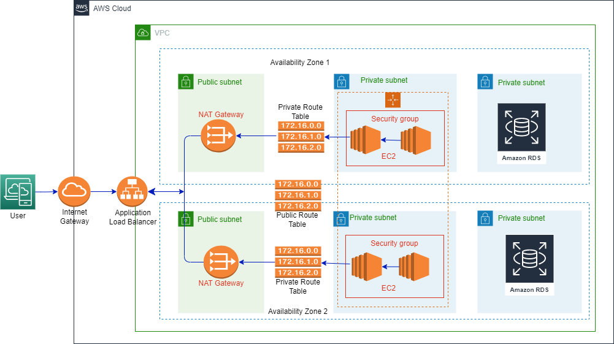

## Scalable and Secure Web Application Architecture  
  
  
  
The plan is to launch a web application, and to achieve this, we set up an AWS environment using Terraform. The architecture will consist of the following components:

1. Auto-scaling EC2 Instances: Virtual servers that can automatically adjust their capacity based on traffic demand.
2. Load Balancer: Distributes incoming requests across multiple EC2 instances to ensure even workload distribution and high availability.
3. RDS Instance: A managed relational database service to store application data securely.
4. Secure Communication: Establishing secure communication between EC2 instances and the RDS instance.

## Auto-scaling EC2 Instances

Auto-scaling allows our web application to adapt to varying levels of traffic. We will use Amazon EC2 (Elastic Compute Cloud) instances, which are virtual servers in the AWS cloud. The Terraform script will set up an auto-scaling group of EC2 instances behind a load balancer. This group automatically adjusts the number of instances based on incoming traffic. During high demand, it adds more EC2 instances, and during low demand, it removes unnecessary instances. This ensures optimal performance and cost efficiency.

## Load Balancer

The load balancer acts as the entry point for incoming traffic. It sits in front of the EC2 instances and distributes requests across the available instances. This ensures an even distribution of the workload, preventing any single instance from becoming overloaded. The load balancer also performs health checks on the EC2 instances and automatically directs traffic away from any unhealthy instances. This setup guarantees high availability, as even if some instances fail, the load balancer routes traffic to healthy ones.

## RDS Instance

For our web application's database needs, we will use Amazon RDS (Relational Database Service). RDS is a fully managed and scalable database service in AWS. The Terraform script will create an RDS instance, which will store application data securely and efficiently. The managed nature of RDS allows us to focus on our application's functionality while AWS handles the database administration tasks.

## Secure Communication

Security is a top priority, and we will ensure secure communication between the EC2 instances and the RDS instance. By default, AWS sets up the RDS instance in a private subnet, making it inaccessible from the internet directly. The EC2 instances, on the other hand, are deployed in a public subnet, and incoming traffic is routed to them through the load balancer. This design provides an additional layer of security, as the RDS instance is shielded from direct external access.

## Communication Flow

1. A user accesses the web application through the load balancer's public DNS name.
2. The load balancer distributes the user's request to one of the healthy EC2 instances.
3. The EC2 instance processes the request and interacts with the RDS instance to retrieve or store data.
4. The RDS instance handles the database operations and responds back to the EC2 instance.
5. The EC2 instance sends the response back to the user through the load balancer.
  
## Running the scripts

The Terraform scripts in this repo allow you to set up an AWS environment for a web application with the following components:

1. Auto-scaling EC2 instances behind a load balancer to handle incoming traffic efficiently and ensure high availability.
2. An RDS (Relational Database Service) instance to store application data securely.

## Prerequisites  

Before you begin, make sure you have the following:

1. AWS Account: You will need an AWS account with appropriate permissions to create resources
2. Terraform: Ensure you have Terraform installed on your local machine. You can download it from [Terraform website](https://www.terraform.io/downloads.html)

## Usage  

1. Clone this repository to your local machine:

   ```bash
   git clone https://github.com/kennedyuc/aws-webApp-terraform.git
     
   cd aws-webApp-terraform  
   ```  

2. Update vars.tfvars file with the necessary variables:  
   
   ```
    env                 = "dev"
    project_name        = "devops_task"
    vpc_cidr            = "10.0.0.0/16"
    enable_vpc_dns      = true
    subnet_count        = 2
    subnet_bits         = 8
    ec2_ami_id          = "ami-061dbd1209944525c"
    ec2_instance_type   = "t2.medium"
    min_instance_count  = 2
    max_instance_count  = 4
    db_storage_size     = 20
    db_storage_type     = "gp2"
    db_engine_type      = "postgres"
    db_engine_version   = "14.8"
    db_instance_class   = "db.t3.micro"
    db_name             = "postgres"
    aws_region          = "us-east-1"
   ```

3. Initialize Terraform:  

    ```bash  
    terraform init  
    ```  

4. Terraform plan:

    ```bash
    terraform plan -var-file vars.tfvars
    ```  
      
    You will be prompted to enter the values for the following parameters from the command line:  
      
    ```  
    db_username         = "XXXXX"
    db_password         = "XXXXX"
    aws_region          = "XXXXX"
    user_access_key     = "XXXXX"
    user_secret_key     = "XXXXX"  
    ```  
      
5. Terraform apply:  
  
    ```bash
    terraform apply -var-file vars.tfvars  
    ```  
      
    You will be prompted to enter the same values as with the step above.  

6. Cleanup:

    ```bash
    terraform destroy -var-file vars.tfvars  
    ```